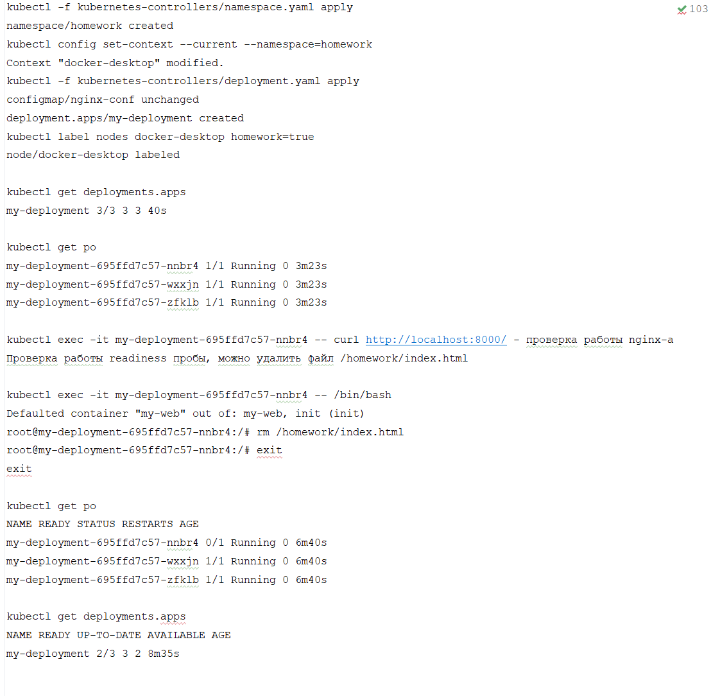
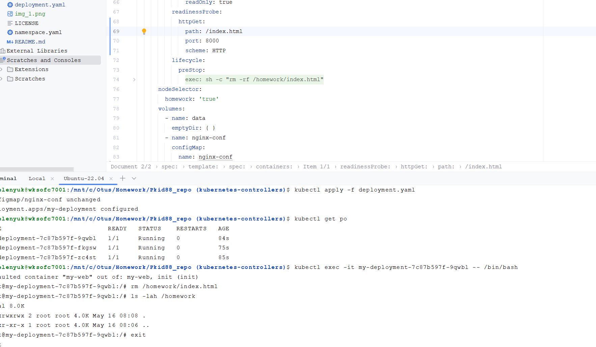
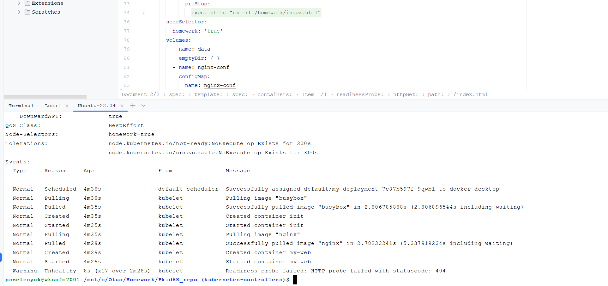
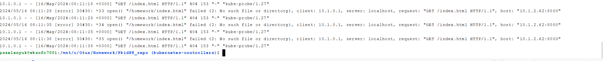

# Репозиторий для выполнения домашних заданий курса "Инфраструктурная платформа на основе Kubernetes-2024-02" 

**Описание:**

Создан namespace homework
Создан деплоймент my-deployment, создаётся 3 экземпляра пода(nginx-a, с конфигурацией из 1-ого ДЗ).
Добавлена readiness проба, проверка на наличие файла /homework/index.html/
Стратегия обновления RollingUpdate - может быть недоступен максимум 1-под
Добавлено правило запуска deployment-a только на нодах c меткой homework=true

Проверка ReadinessProbe HTTP
kubectl describe po my-deployment-7c87b597f-9qwbl

kubectl logs my-deployment-7c87b597f-9qwbl
